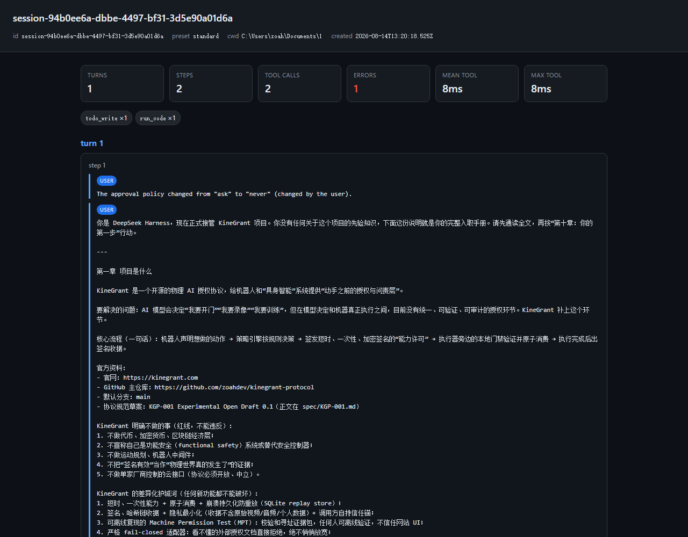

# dsh-replay — time-travel debugger for DeepSeek Harness agents

Replay, visualize, and diff a DeepSeek Harness session's **full trajectory** straight from `session.jsonl.zstd` — the ground-truth event log. No `@deepseek-ai/dsh` dependency; just Node ≥ 22.19 (its bundled zstd).



## Why

Debugging an agent by scrolling the terminal only shows the last N lines. dsh's session log already contains everything — every reasoning delta, every tool call, every result, with seq + timestamps — but it's a concatenated-zstd, packed-row format nobody can read by hand. dsh-replay decodes that format and renders it as a readable timeline.

## What it does

- **Decode** the concatenated-Zstandard container and the packed `text-chunks`/`reasoning-chunks`/`tool-call-chunks` rows (the exact `@deepseek-ai/dsh-session` wire format, re-implemented with zero deps).
- **Reconstruct** turns → steps → user messages → reasoning → assistant text → tool calls with results (success/error).
- **Render** a self-contained dark-mode HTML timeline.
- **Diff** two sessions turn-by-turn (where did the two runs diverge?).
- **Summarize** per-tool call counts, error count, and latency as JSON (`--stats`).

## Install / run

```sh
node bin/replay.mjs <session-id> --out replay.html
# or point at a file directly
node bin/replay.mjs --file ~/.dsh/sessions/.../session.jsonl.zstd
# print a turn/tool/error summary as JSON
node bin/replay.mjs <session-id> --stats
# compare two runs
node bin/replay.mjs diff <id-a> <id-b>
# compare two runs and render a side-by-side HTML diff
node bin/replay.mjs diff <id-a> <id-b> --diff-html
```

Open `replay.html` in any browser.

## Example

```sh
node bin/replay.mjs session-94b0ee6a-dbbe-4497-bf31-3d5e90a01d6a
# -> session-94b0ee6a...replay.html
```

## Correctness

The decoder mirrors the upstream `scanZstdFrames` + `decodeStorageRecord` format. Tests cover the packed-row expansion, tool-call/result reconstruction, and the diff summarizer.

```sh
npm test
```

## Related

- [dsh-shelf](https://github.com/zoahdev/dsh-shelf) — session lifecycle CLI (list/stats/export/trash/rescue).
- [dsh-plugin-doctor](https://github.com/zoahdev/dsh-plugin-doctor) — plugin + profile preflight.

---

# dsh-replay — DeepSeek Harness agent 的"时间旅行调试器"

从 `session.jsonl.zstd` 直接回放、可视化、对比一个会话的完整轨迹。这是 dsh 的 ground-truth 事件日志，包含每次推理分片、每次工具调用、每次结果。零依赖，只需 Node ≥ 22.19。

```sh
node bin/replay.mjs <session-id> --out replay.html
node bin/replay.mjs diff <id-a> <id-b>
```

打开 `replay.html` 即可看到按 turn → step 组织的轨迹：用户消息、推理（可折叠）、回复文本、工具调用（参数 + 成功/失败结果）。
